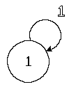

  
  
  # tinystate
  
    
  

A small, fast and `no_std` finite state machine for Rust.
`tinystate` provides a compile-time validated state machine implementation with zero runtime overhead.

(only when validating it it's O(n^2) at runtime, but since `NE` and `NS` are known it's O(1) :P)

## Contributing

Feel free, I need to make the costs actually useful

## License

MIT
