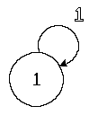

  
  
  # tinystate
   
  
    
  

A small, fast and `no_std` finite state machine for Rust.
`tinystate` provides a compile-time validated state machine implementation with zero runtime overhead.

## Contributing

Feel free!

## License

MIT
